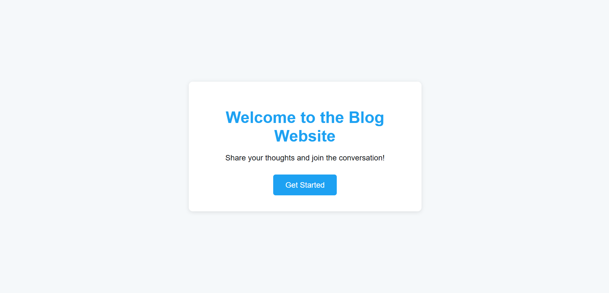
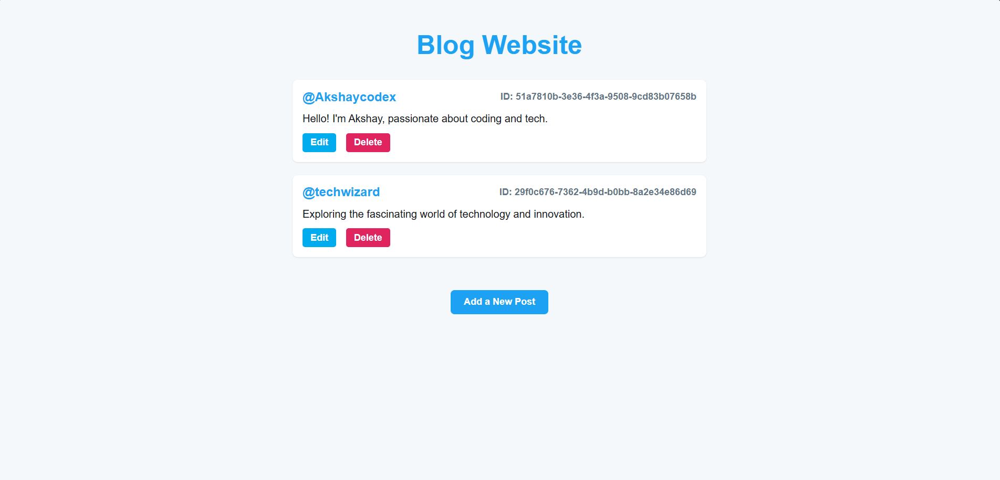
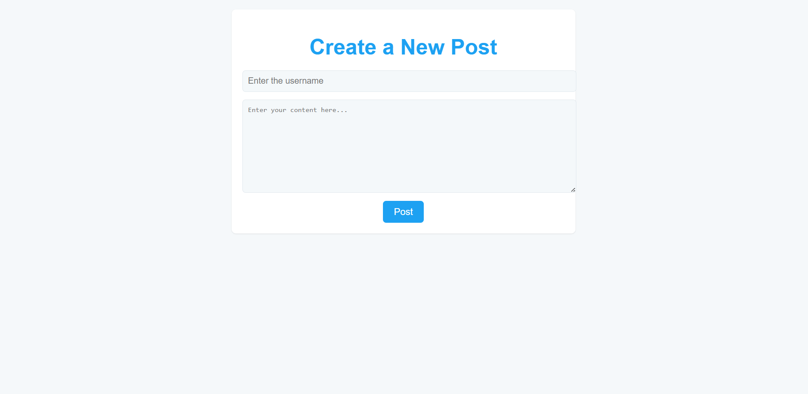
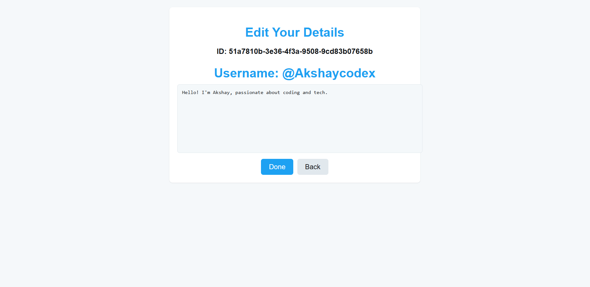

# Blog Website with Express and EJS

A simple blog website built using **Express.js** and **EJS** for rendering dynamic views. This app allows users to create, view, edit, and delete blog posts with features like UUID-based post IDs for uniqueness.

## Features

### 1. Welcome Page

The application starts with a welcoming page that introduces the user to the blog platform.



### 2. All Posts Page

Displays a list of all posts in the blog with their usernames and content.

**Features**:
- View the content of all posts.
- Options to **Edit** and **Delete** each post.



### 3. Add a New Post (Create a Post)

- **Step 1**: Navigates to the page where you can create a new post. A form is displayed asking for a username and content for the post.
- **Step 2**: When the form is submitted, the post is added to the list of posts and stored with a unique UUID for identification.



### 4. Edit a Post

- **Step 1**: Clicking the **Edit** button on a post will navigate the user to the **Edit Page**.
- **Step 2**: The user can modify the content of the post and save the changes. After editing, the post is updated with the new content.



### 5. Delete a Post

The user can delete a post from the list.

**How it works**:
- When the **Delete** button is pressed, the post is removed from the list, and the user is redirected back to the posts page.


---

## How to Run the Project

### 1. Clone the Repository

```bash
git clone <your-repository-url>
